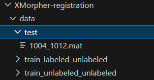

# XMorpher deformable registration between cardiac CT scans. CT pairs must undergo affine registration before deformable registration (a necessary step before deformable).

# Create environment
conda env create -f environment.yml

# Activate
conda activate XMorpher-Reg

# Search for bin anywhere in your environment 
find /path/to/miniconda3/envs/XMorpher-Reg/bin 

# Data organization
The data organization example is shown below: 

The folders train_labeled_unlabeled and train_unlabeled_unlabeled are used for training, and the data in the test folder is used for testing.

# How to prepare the dataset:
Follow the instructions in Prepare-Data/preprocessing.ipynb.

# Run the script
Run python Unsup_train.py for unsupervised training.

Run python Semi_train.py for semi-supervised training.

